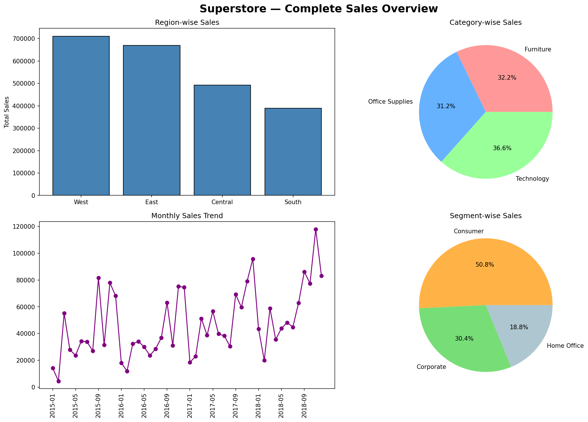

# 📊 Superstore Sales Analysis

## Project Overview
Complete sales data analysis of Superstore dataset using Python and Pandas.

## Tools Used
- Python, Pandas, Matplotlib

## Analysis Done
- Region-wise Total Sales
- Category-wise Sales Distribution
- Top 10 Products by Sales
- Monthly Sales Trend
- Segment-wise Sales Distribution
- Ship Mode Usage

## Key Findings
- West region generates highest sales (₹7.1 lakh)
- Technology category leads with 36.6% share
- Canon imageCLASS 2200 Copier is the best-selling product
- Sales peak every December - seasonal pattern
- Consumer segment contributes 50.8% of total sales

## Dataset
Superstore Sales Dataset
